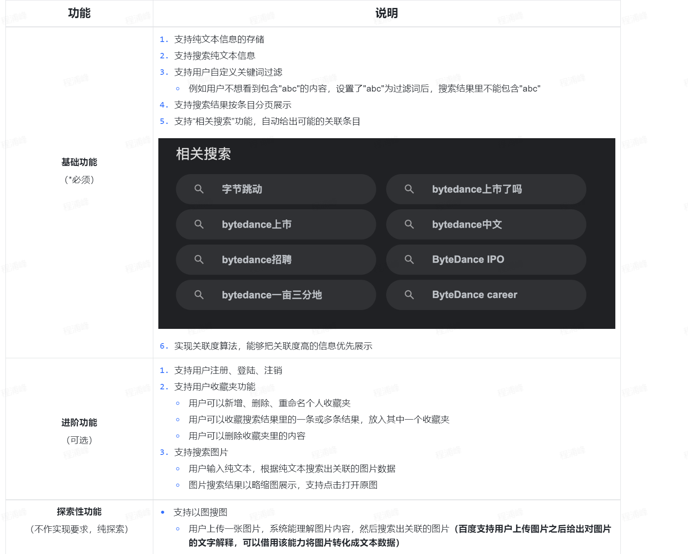

# SearchEngine-qxy



# api

## 增加/修改索引

### /api/index

请求方式：POST

请求类型：application/json

请求：

| 字段             | 类型   | 描述                                   |      |
| ---------------- | ------ | :------------------------------------- | ---- |
| id               | uint32 | 文档主键id，保持唯一性，id重复则会覆盖 |      |
| text             | string | 需要索引的文本                         |      |
| document:url     | string | 文档数据的图片url段                    |      |
| document:rawtext | string | 文档数据的原标题                       |      |

```json
{
  "id": 1,
  "text": "曾是名不见经传的王平,为何能够取代魏延,成为蜀汉",
  "document": {
    "url": "https://pic.rmb.bdstatic.com/19539b3b1a7e1daee93b0f3d99b8e795.png",
    "rawtext": "曾是名不见经传的王平,为何能够取代魏延,成为蜀汉"
  }
}
```

响应

```json
{
  "state": true,
  "message": "success"
}
```

建立正排索引

docStorage: key = "id" ; value = { all }

postiveIndexStorage: key = "id" ; value = {分词} []string

将text分词word{...}，建立倒排索引:

invertedIndexStorage: key = 单个分词 string->[]byte ; value = {ids}对应doc和postive中的key值，插入时先s.get(key)，如果找到了，二分查找，如果找到了就不append，没找到直接append


## 批量增加/修改索引

### /api/index/batch

## 删除索引

### /api/remove

## 查询索引

### /api/query

## 添加屏蔽词

### /api/block

## 相关搜索

### /api/related

## 用户注册

/user/signup

## 用户登录

/user/login

## 用户注销

/user/logout

## 用户收藏夹

/user/like

## 搜索图片？

## 以图搜图

用百度搜图将图片转化为文本数据再调用查询索引

# 技术栈

平衡二叉查找树：基于文件分片，分几片就是几个树

二分查找

快速排序

倒排索引

正排索引

[正排索引和倒排索引 - 郭慕荣 - 博客园 (cnblogs.com)](https://www.cnblogs.com/jelly12345/p/15016494.html)

gojiaba分词

数据库：leveldb？

相关搜索：字典树？[搜索引擎系列(二)---相关搜索 | SingleX | 倘若一成不变，何以激荡人心。 (singlecool.com)](https://singlecool.com/2017/07/29/RelevantSearch/)

# 分工

数据库交互接口：
增删查接口：
http服务：


简化，不分片